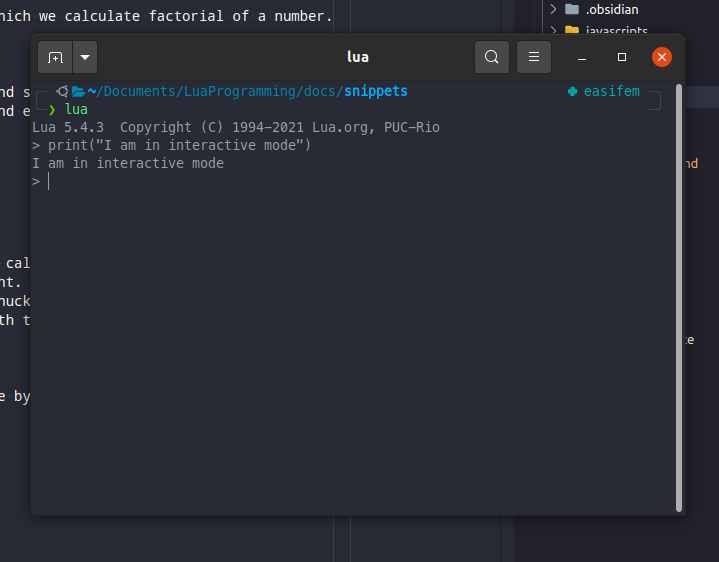

# LUA Programming

## Introduction

Lua is a very powerful programming language. It can be used effeciently to build embedded system, mobile device, games, among other applications :fire:. Lua can talk to programs written in C, C++, Fortran, Python, and many other programming languages :rocket:. Actually, for many of its tasks, Lua depends upon the program written in other languages, such as C. Needless to state, Lua is a high-level language designed to make our life easy. Lua has many features such as, Dynamic typing, automatic memory managements, functions are part of data types in Lua :star:.

Lua is extensible language. It is also a glue language. Lua allows us to employ component based approach to develop the softwares. These components may be developed in low level programming languages. Lua is the glue used for stiching these components :cloud:. In addition, Lua is simple, small, and efficient.

There are several references to learn Lua. I am providing some links below.

- :heart: [Reference manual](https://www.lua.org/manual/5.4/)
- :moon: [Lua official website](https://www.lua.org/docs.html)
- :book: [Programming in Lua](https://www.amazon.com/exec/obidos/ASIN/8590379868/lua-pilindex-20)

## Downloading lua

Before installing Lua on your system, try it online using this [website](https://www.lua.org/demo.html). You can download lua using `curl` command as shown below.

```bash
curl -R -O http://www.lua.org/ftp/lua-5.4.3.tar.gz
tar zxf lua-5.4.3.tar.gz
cd lua-5.4.3
```

Otherwise, you can download the tar file from the official [website](https://www.lua.org/download.html).

The structure of the lua directory is shown below

```txt
lua-5.4.3
.
├── doc
├── Makefile
├── README
└── src
```

## Building Lua

Lua is written in ANSI C, so to build lua all we need a ANSI C compiler. I use *gcc* compiler to build lua from source, and the build process which I follow is given [here](https://www.lua.org/manual/5.4/readme.html) :material-hand-pointing-left:

Step-1:

```bash
cd lua-5.4.3
```

Step-2:

Now we run the `make` command, which checks the availability of compilers and varius other things on our system.

```bash
make
```

When we run this command, you can see following lines printing on the terminal screen.

Following is the output on terminal

```txt
make[1]: Entering directory '/home/vikassharma/softwares/lua-5.4.3/src'
Guessing Linux
make[2]: Entering directory '/home/vikassharma/softwares/lua-5.4.3/src'
make all SYSCFLAGS="-DLUA_USE_LINUX" SYSLIBS="-Wl,-E -ldl"
make[3]: Entering directory '/home/vikassharma/softwares/lua-5.4.3/src'
gcc -std=gnu99 -O2 -Wall -Wextra -DLUA_COMPAT_5_3 -DLUA_USE_LINUX    -c -o lapi.o lapi.c
.
.
.
make[3]: Leaving directory '/home/vikassharma/softwares/lua-5.4.3/src'
make[2]: Leaving directory '/home/vikassharma/softwares/lua-5.4.3/src'
make[1]: Leaving directory '/home/vikassharma/softwares/lua-5.4.3/src'
```

Now Lua has been build. We need to install it to write place. I am going to install it at local place "~/.easifem/extpkgs/". You can select any path. But if you are installing it at `/usr/local/`, then you may need root privilage.

```txt
make install INSTALL_TOP=~/.easifem/extpkgs/
```

We get following message to from this command.

```txt
cd src && mkdir -p /home/vikassharma/.easifem/extpkgs/bin /home/vikassharma/.easifem/extpkgs/include /home/vikassharma/.easifem/extpkgs/lib /home/vikassharma/.easifem/extpkgs/man/man1 /home/vikassharma/.easifem/extpkgs/share/lua/5.4 /home/vikassharma/.easifem/extpkgs/lib/lua/5.4
cd src && install -p -m 0755 lua luac /home/vikassharma/.easifem/extpkgs/bin
cd src && install -p -m 0644 lua.h luaconf.h lualib.h lauxlib.h lua.hpp /home/vikassharma/.easifem/extpkgs/include
cd src && install -p -m 0644 liblua.a /home/vikassharma/.easifem/extpkgs/lib
cd doc && install -p -m 0644 lua.1 luac.1 /home/vikassharma/.easifem/extpkgs/man/man1
```

The `make install` command put following directory at `~/.easifem/extpkgs`

```txt
.
├── bin
├── include
├── lib
│   ├── cmake
│   ├── lua
│   └── pkgconfig
├── man
│   └── man1
└── share
    ├── cmake
    ├── doc
    ├── docs
    ├── lua
    └── man
```

The content of these folder is given below

```txt
bin:
    lua luac
include:
    lua.h luaconf.h lualib.h lauxlib.h lua.hpp
lib:
    liblua.a
man/man1:
    lua.1 luac.1
```

> These are the only directories you need for development. If you only want to run Lua programs, you only need the files in bin and man. The files in include and lib are needed for embedding Lua in C or C++ programs.

Now you can run following command for a check.

```bash
which lua
/home/vikassharma/.easifem/extpkgs/bin/lua
```

if you get an error then you need to put the path of binary files in your `~/.bashrc` or `~/.zshrc`. It can be done by adding following line in one of these files.

```bash
# This goes into either ~/.bashrc (if bash is your shell) or ~/.zshrc if zsh is your shell
export PATH="$PATH:~/.easifem/extpkgs/bin"
```

Then, run the following command.

```bash
source ~/.zshrc
source ~/.bashrc
```

## Package manager

[LuaRocks](https://luarocks.org/) :rocket: is a package manage for lua modules. We do not need this at this moment, just have a look at it. We will learn about it later.

## First lua program: Hello world

Lets create our first lua script. We will call it `hello.lua`. The content if shown below.

```lua
-- this is a comment which start from two consecutive dashes.
print("Lua says, Hello World")
```

Now lets run this program on terminal.

```bash
╭─ ~/Documents/LuaProgramming/docs/snippets
╰─❯ lua hello.lua
Lua says, Hello World
```

## Factorial

Now lets create one more program, in which we calculate factorial of a number.

- Ask user for a positive number
- Check if the number is positive
  - If true then calculate factorial and show the result on screen
  - If false, then show the warning, and exit

```lua
-- factorial of an integer
function factorial( n )
  if n == 0 then
    return 1
  elseif n < 0 then
    print("Wrong integer, n should be nonnegative, exitings")
    os.exit()
  else
    return n * factorial(n-1)
  end
end -- end of function
print("Enter a number [n] : ")
n = io.read("*n")
print(factorial(n))
```

## Chunk

Each piece of code that lua execute is called chunk. So in `hello.lua` the chunk consists single line of code, which is a print statement. On the other hand, in `factorial.lua`, the chuck consists several lines. In this way, chuck can be very small or very big, lua has no issue with that. Actually, lua can easily deal with the big chunk of data.

## Interactive mode

We can start lua in an interactive mode by just typing `lua` in the terminal window. The result is shown in the following screenshot.



Now lua is waiting for our commands. So we can type lua commands in it.

We also have the following command.

```bash
lua -i factorial.lua
```

This will first run the factorial.lua, then start interactive mode. Note that the content of `factorial.lua` will be avaiable in the interactive mode. So if we type `factorial(4)`{.lua} in the interactive mode we will get 24. In this way, the functins defined inside the script files are available in the interactive mode.

## Some points to remember

> Lua is case sensitive

> Anything after two dashes -- is a comment in lua For block comment we use `--[[` ... `--]]` as shown below

```lua
--[[
  print("I am inside a block comment, so i am inactive :(")
  a = a+2
--]]

---[[
  print("I am out of block comment, I am active, thank you extra - :)")
  a = a+2
--]]
```

## Types in Lua

>Lua is dynamically types language

Lua has following data type

- `boolean`
- `number`
- `string`
- `function`
- `table`
- `userdata`
- `nil`

We can find the type of a variable using `type()` function, which returns string. You can try following commands online.



```lua
print(type(1)) -- number
print(type(true)) -- boolean
print(type("hello")) -- string
print(type(type)) -- function
```

> nil type is used by lua to represent non-value. An undefined variable has nil type. When we assign a variable nil then that variable becomes undefined.

> `boolean` has two values `true` and `false`. Only `false` and `nil` has false value, rest are treated as true. For example, 0 and empty string are considered as `true` in lua.

> Lua supports `and` `or` `not` boolean operators. `and` and `or` use short-circuit evaluation. It means that while evaluating `a and b`, b will be evaluated only when `a` is `true`. Similarly, in `a or b`, a will not be evaluated if `a` is true.

> `a=a or b` implies that if `a` is not true, then a is equal to b. It is used to defined the default value of a.