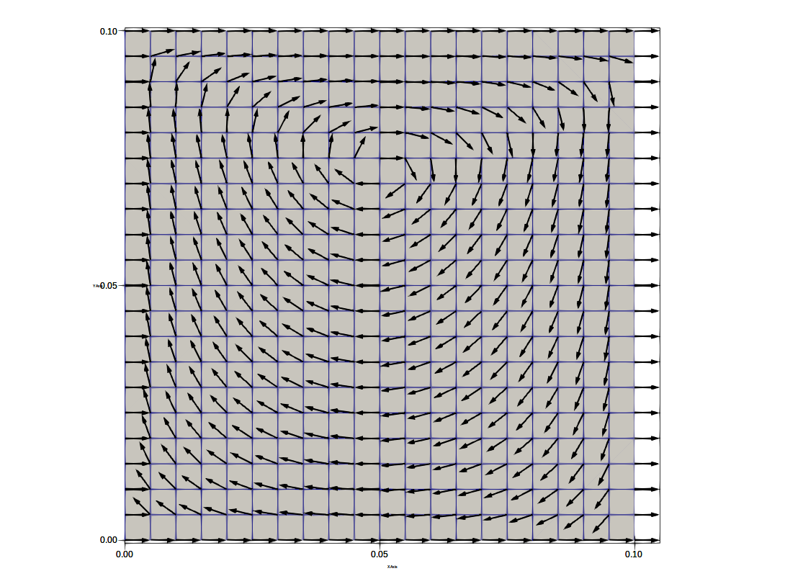

# Design of SteadyStokesKernel

## Governing equation

$$
\nabla p-\nabla\cdot\tau-\rho\mathbf{b}=\mathbf{0},
$$

$$
\nabla\cdot\mathbf{v}=0
$$

$$
-p{\bf n}+\tau\cdot{\bf n}={\bf h}\text{ on }\Gamma_{h}
$$

$$
\tau=2\mu\mathbf{d}(\mathbf{v})
$$

$$
d_{ij}=\frac{1}{2}\left(\frac{\partial v_{i}}{\partial x_{j}}+\frac{\partial v_{j}}{\partial x_{i}}\right)
$$

## VMS stabilized form

$$
\begin{aligned} & \int_{\Omega}2\mu\nabla\delta{\bf v}:{\bf d}({\bf v})d\Omega-\int_{\Omega}p\nabla\cdot\delta{\bf v}d\Omega+\int_{\Omega}\delta p\nabla\cdot{\bf v}d\Omega\\ & +\sum_{e}\int_{\Omega_{e}}\rho^{-1}\tau_{SUPS}\nabla\delta p\cdot{\bf r}_{M}\left(\boldsymbol{v},p\right)d\Omega\\ & \pm\sum_{e}\int_{\Omega_{e}}\rho^{-1}\tau_{SUPS}\nabla\cdot2\mu{\bf d}\left(\delta{\bf v}\right)\cdot{\bf r}_{M}\left(\boldsymbol{v},p\right)d\Omega\\ & +\sum_{e}\int_{\Omega_{e}}\left(\nabla\cdot\delta\bar{{\bf v}}\right)\rho\nu_{LSIC}\nabla\cdot{\bf v}d\Omega\\ & =\int_{\Omega}\delta v_{i}\rho b_{i}d\Omega+\int_{\Gamma_{i}^{h}}\delta v_{i}h_{i}d\Omega \end{aligned}
$$

### Weak form of conservation of linear momentum

$$
\begin{aligned} & \int_{\Omega}2\mu\nabla\delta{\bf v}:{\bf d}({\bf v})d\Omega\\ & \mp\sum_{e}\int_{\Omega_{e}}\rho^{-1}\tau_{SUPS}\left\{ \nabla\cdot2\mu{\bf d}\left(\delta{\bf v}\right)\right\} \cdot\left\{ \nabla\cdot2\mu{\bf d}\left({\bf v}\right)\right\} d\Omega\\ & +\sum_{e}\int_{\Omega_{e}}\left(\nabla\cdot\delta\bar{{\bf v}}\right)\rho\nu_{LSIC}\nabla\cdot{\bf v}d\Omega\\ & -\int_{\Omega}\left(\nabla\cdot\delta{\bf v}\right)pd\Omega\\ & \pm\sum_{e}\int_{\Omega_{e}}\rho^{-1}\tau_{SUPS}\left\{ \nabla\cdot2\mu{\bf d}\left(\delta{\bf v}\right)\right\} \cdot\nabla pd\Omega\\ & =\int_{\Omega}\delta v_{i}\rho b_{i}d\Omega+\int_{\Gamma_{i}^{h}}\delta v_{i}h_{i}d\Omega\\ & \pm\sum_{e}\int_{\Omega_{e}}\rho^{-1}\tau_{SUPS}\left\{ \nabla\cdot2\mu{\bf d}\left(\delta{\bf v}\right)\right\} \cdot\left\{ \rho\mathbf{b}\right\} d\Omega \end{aligned}
$$

### Conservation of mass

$$
\begin{aligned} & \int_{\Omega}\delta p\nabla\cdot{\bf v}d\Omega-\sum_{e}\int_{\Omega_{e}}\rho^{-1}\tau_{SUPS}\nabla\delta p\cdot\left\{ \nabla\cdot2\mu{\bf d}({\bf v})\right\} d\Omega\\ & +\sum_{e}\int_{\Omega_{e}}\rho^{-1}\tau_{SUPS}\nabla\delta p\cdot\nabla pd\Omega=\sum_{e}\int_{\Omega_{e}}\rho^{-1}\tau_{SUPS}\nabla\delta p\cdot\rho\mathbf{b}d\Omega \end{aligned}
$$

## SteadyStokes111 Kernel in EASIFEM

### Declare some variables

```fortran
#define _VTOP_ 1.0_DFP
#define _MU_FLUID_ 0.01
#define _RHO_FLUID_ 1.0
#define _tDBC4P_ 1
#define _REF_PRESSURE_NODE_ 90
#define _STAB_PARAM_OPTION_ 1

PROGRAM main
  USE easifemBase
  USE easifemClasses
  USE easifemMaterials
  USE easifemKernels
  USE SteadyStokes111_Class
  IMPLICIT NONE
  !!
  !!
  !!
  TYPE(SteadyStokes111_) :: obj
  TYPE(ParameterList_) :: param
  TYPE(HDF5File_) :: domainFile
  TYPE( HDF5File_ ) :: outputfile
  TYPE( VTKFile_ ) :: vtk_outputfile
  TYPE(MeshSelection_) :: region
  TYPE(Domain_), TARGET :: dom
  CLASS(DirichletBC_), POINTER :: dbc => NULL()
  CHARACTER(LEN=*), PARAMETER :: domainFileName = "./mesh.h5"
  CHARACTER( LEN = * ), PARAMETER :: outputfilePrefix="./output"
  !!
  !! LinSolver
  !!
  INTEGER(I4B), PARAMETER :: LinSolver_name = LIS_GMRES
  INTEGER(I4B), PARAMETER :: KrylovSubspaceSize = 50
  INTEGER(I4B), PARAMETER :: maxIter_LinSolver = -1
  REAL(DFP), PARAMETER :: rtol_LinSolver=1.0D-6
  REAL(DFP), PARAMETER :: atol_LinSolver=1.0D-10
  INTEGER(I4B), PARAMETER :: preconditionOption = NO_PRECONDITION
  INTEGER(I4B), PARAMETER :: convergenceIn_LinSolver = convergenceInRes
  INTEGER(I4B), PARAMETER :: convergenceType_LinSolver = relativeConvergence
  LOGICAL( LGT ), PARAMETER :: relativeToRHS = .FALSE.
  !!
  !! Iteration parameter
  !!
  INTEGER( I4B ), PARAMETER :: stabParamOption = _STAB_PARAM_OPTION_
  LOGICAL( LGT ), PARAMETER :: resetIteration = .TRUE.
  LOGICAL( LGT ), PARAMETER :: resetTimeStep = .TRUE.
  INTEGER( I4B ), PARAMETER :: postProcessOpt = 1
  !!
  !! material and boundary condition
  !!
  INTEGER(I4B), PARAMETER :: tFluidMaterials = 1
  INTEGER(I4B), PARAMETER :: tDirichletBCForVelocity = 3
  INTEGER(I4B), PARAMETER :: tDirichletBCForPressure = _tDBC4P_
  INTEGER( I4B ), PARAMETER :: refPressureNode = _REF_PRESSURE_NODE_
  REAL(DFP), PARAMETER :: massdensity_fluid= _RHO_FLUID_
  REAL(DFP), PARAMETER :: dynamicViscosity= _MU_FLUID_
  REAL(DFP), PARAMETER :: V_TOP= _VTOP_
  INTEGER( I4B ) :: debugNo = 0
```

## Preprocessing

```fortran
!!
  !! main
  !!
  CALL FPL_INIT(); CALL param%Initiate()
  !!
  !! Set SteadyStokes111 Param
  !!
  CALL SetSteadyStokes111Param( &
    & param=param, &
    & domainFile=domainFileName, &
    & stabParamOption=stabParamOption, &
    & tFluidMaterials=tFluidMaterials, &
    & tDirichletBCForVelocity=tDirichletBCForVelocity, &
    & tDirichletBCForPressure=tDirichletBCForPressure, &
    & postProcessOpt = postProcessOpt )
  !!
  !! Set linear solver param
  !!
  CALL SetLinSolverParam( &
    & param=param, &
    & solverName=LinSolver_name,&
    & preconditionOption=preconditionOption, &
    & convergenceIn=convergenceIn_LinSolver, &
    & convergenceType=convergenceType_LinSolver, &
    & maxIter=maxIter_LinSolver, &
    & relativeToRHS=relativeToRHS, &
    & KrylovSubspaceSize=KrylovSubspaceSize, &
    & rtol=rtol_LinSolver, &
    & atol=atol_LinSolver )
  !!
  !! Domain for pressure and velocity field
  !!
  CALL domainFile%Initiate( filename=domainFileName, MODE="READ")
  CALL domainFile%Open()
  CALL dom%Initiate(domainFile, "")
  CALL domainFile%Deallocate()
  !!
  !! Initiate the SteadyStokes111 Solver
  !!
  CALL obj%Initiate(param=param, dom=dom)
  !!
  !! Add Fluid Material
  !!
  CALL region%Initiate(isSelectionByMeshID=.TRUE.)
  CALL region%Add(dim=obj%nsd, meshID=[1,2])
  !!
  CALL SetFluidMaterialParam( &
    & param=param, &
    & name="fluidMaterial", &
    & massDensity=massdensity_fluid, &
    & dynamicViscosity=dynamicViscosity, &
    & stressStrainModel="NewtonianFluidModel" )
  CALL SetNewtonianFluidModelParam( &
    & param = param, &
    & dynamicViscosity = dynamicViscosity )
  !!
  CALL obj%AddFluidMaterial( &
    & materialNo=1, &
    & materialName="fluidMaterial", &
    & param=param, &
    & region=region )
  !!
  CALL region%Deallocate()
  !!
  !! DirichletBC Vx=0
  !!
  CALL SetDirichletBCParam( &
    & param=param, &
    & name="Vx=0", &
    & idof=1, &
    & nodalValueType=Constant, &
    & useFunction=.FALSE.)
  CALL region%Initiate( &
    & isSelectionByMeshID=.TRUE., &
    & isSelectionByNodeNum=.TRUE. )
  CALL region%Add(dim=obj%nsd-1, meshID=[1,2,6])
  CALL region%Add( &
    & nodenum=dom%getInternalNptrs( dim=obj%nsd-1, entityNum=[3,5] ) )
  CALL region%Set()
  !!
  CALL obj%AddVelocityDirichletBC(dbcNo=1, param=param, boundary=region)
  CALL region%Deallocate()
  dbc => obj%GetVelocityDirichletBCPointer(dbcNo=1)
  CALL dbc%Set(ConstantNodalValue=0.0_DFP)
  dbc => NULL()
  !!
  !! DirichletBC Vy=0
  !!
  CALL SetDirichletBCParam( &
    & param=param, &
    & name="Vy=0", &
    & idof=2, &
    & nodalValueType=Constant, &
    & useFunction=.FALSE.)
  !!
  CALL region%Initiate(isSelectionByMeshID=.TRUE.)
  CALL region%Add(dim=obj%nsd-1, meshID=[1,2,3,4,5,6])
  CALL region%Set()
  !!
  CALL obj%AddVelocityDirichletBC(dbcNo=2, param=param, boundary=region)
  CALL region%Deallocate()
  dbc => obj%GetVelocityDirichletBCPointer(dbcNo=2)
  CALL dbc%Set(ConstantNodalValue=0.0_DFP)
  dbc => NULL()
  !!
  !! DirichletBC Vx=Vtop
  !!
  CALL SetDirichletBCParam( &
    & param=param, &
    & name="Vx=V", &
    & idof=1, &
    & nodalValueType=Constant, &
    & useFunction=.FALSE.)
  !!
  CALL region%Initiate(isSelectionByMeshID=.TRUE.)
  CALL region%Add(dim=obj%nsd-1, meshID=[4])
  CALL region%Set()
  !!
  CALL obj%AddVelocityDirichletBC(dbcNo=3, param=param, boundary=region)
  CALL region%Deallocate()
  dbc => obj%GetVelocityDirichletBCPointer(dbcNo=3)
  CALL dbc%Set(ConstantNodalValue=V_TOP)
  dbc => NULL()
  !!
  !! DirichletBC P=0
  !!
  IF( tDirichletBCForPressure .GT. 0 ) THEN
    CALL SetDirichletBCParam( &
      & param=param, &
      & name="P=0", &
      & idof=1, &
      & nodalValueType=Constant, &
      & useFunction=.FALSE.)
    CALL region%Initiate( &
      & isSelectionByNodeNum=.TRUE. )
    CALL region%Add( nodenum=[refPressureNode])
    CALL region%Set()
    !!
    CALL obj%AddPressureDirichletBC(dbcNo=1, param=param, boundary=region)
    CALL region%Deallocate()
    dbc => obj%GetPressureDirichletBCPointer(dbcNo=1)
    CALL dbc%Set(ConstantNodalValue=0.0_DFP)
    dbc => NULL()
  END IF
```

Now we are done with preprocessing, let us call `set`

```fortran
CALL obj%Set( )
CALL outputfile%Initiate(outputfilePrefix//'.h5', "NEW")
CALL outputfile%Open()
CALL obj%Display( "obj: " )
```

## Processing

```fortran
CALL obj%run( param )
```

## Postprocessing

```fortran
  CALL obj%WriteData(outputfile, "" )
  CALL obj%WriteData(vtk_outputfile, "" )
```

## Cleanup

```fortran
  CALL outputfile%Deallocate()
  CALL obj%Deallocate()
  CALL dom%Deallocate()
  CALL param%Deallocate(); CALL FPL_FINALIZE()
```


## Results

Velocity results:




