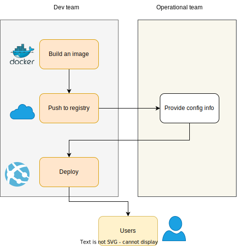
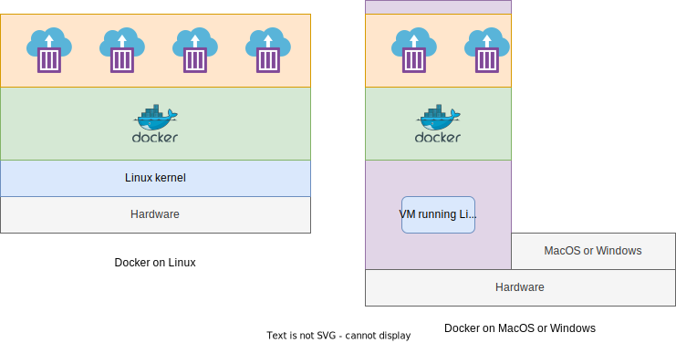

Docker is a tool which can easily encapsulate the process of creating a distributable artifact for any application, deploying it at scale into any environment.

## Why Docker?

- Decreasing the gap between the developer team and packaging and distribution team.
- Resolving dependencies of applications easily; bundling application software and required OS filesystems together in a single
standardized image format.

## VM vs Containers

Virtual machines are typically used for creating an virtualized layer (also known as hypervisor) between the physical hardware and the software applications that run on it. This approach provides very strong isolation between workloads and each VM hosts its own operating system kernel which is located in separate memory space.

> Remember that the hypervisors that manage the VMs and each VM’s running kernel use a percentage of the hardware system’s resources, which are then no longer available to the hosted applications.

A container, on the other hand, is just another process that typically talks directly to the underlying Linux kernel and therefore can utilize more resources, up until the system or quota-based limits are reached. In other words, Linux containers are very lightweight wrappers around a single Unix process. This process can spawn other processes. The libcontainer README provides following definition of a container:

> A container is a self-contained execution environment that shares the kernel of the host system and is (optionally) isolated from other containers in the system.

## Docker Architecture

Docker is a powerful technology, and under the hood it contains tools and processes that come with a high level of complexity.
However, its client/server model hides most of the complexity from the user and makes things very simple for the users.

In this way, although, several components are involved in the Docker API, including `containerd` and `runc`, but the basic system interaction is a client talking over an API to a server.

In this way docker has two parts:

1. docker client
2. dockerd server/daemon

- The server does most of the work such as building, running, and managing our containers.
- We just use the client to tell the server what to do.
- The Docker daemon can run on any number of servers in the infrastructure, and a single client can address any number of servers
- Clients drive all of the communication, but Docker servers can talk directly to image registries when told to do so by the client.

> In summary, clients are responsible for telling servers what to do, and servers focus on hosting and managing containerized applications.

### Docker on Linux host

Docker has traditionally been developed on the Ubuntu Linux distribution, but most Linux distributions and other major operating systems are now supported where possible.

> Red Hat has gone all in on containers, and all of its platforms have first-class support for Docker. With the near-ubiquity of containers in the Linux realm, we now have distributions like Red Hat’s Fedora CoreOS, which is built entirely for Linux container workloads.

### Docker on MacOS and Windows

Docker has released easy-to-use implementations for macOS and Windows. Although, these appear to run natively but are still utilizing a small Linux virtual machine to provide the Docker server and Linux kernel.

When we install docker on MacOS and Windows, a Linux virtual machine is also installed. Docker daemon (dockerd) runs on this Linux (VM) host.

## Docker client

`docker` command is the client, which can talk to the server and docker repository.

The docker client is a Go program, which works on most major operating systems, and the server can run on Linux and Windows server.

## Docker server

`dockerd` command is used for starting the Docker server. Server does all the tasks instructed by the client.

The Docker server is a separate binary from the client and is used to manage most of the work for which Docker is typically used. Next we will explore the most common ways to manage the Docker server.

## Docker images

- Docker and OCI images consist of one or more filesystem layers and some important metadata that represent all the files required to run a containerized application.
- A single image can be copied to numerous hosts.
- An image typically has a repository address, a name, and a tag.
- The tag is generally used to identify a particular release of an image.
- An image can specify environment variables and arguments, which can be set by users for creating several containers from the same image.

## Linux container

- This is a container that has been instantiated from a Docker image.
- A specific container can exist only once; however, you can easily create multiple containers from the same image.
- The term Docker container is a misnomer since Docker simply leverages the operating system’s container functionality.

## Atomic or mutable hosts

An atomic or immutable host is a small, finely tuned OS image, like Fedora CoreOS, that supports container hosting and atomic OS upgrades.

## Further readings on containers

- [Fedora project](https://fedoraproject.org/en/coreos/)
- [Microsoft hyper-v](https://learn.microsoft.com/en-us/virtualization/hyper-v-on-windows/about/)
