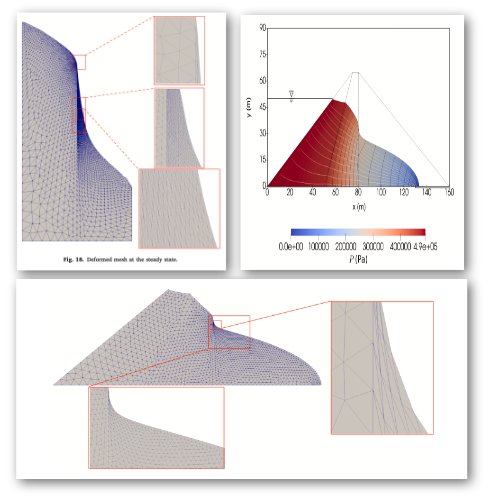

# Space-Time Finite Element Method for Transient and Unconfined Seepage Flow Analysis

Authors: Vikas Sharma, Kazunori Fujisawa, Akira Murakami

## Abstract

This paper aims to develop a moving-mesh type Finite Element Method for the computation of the transient unconfined seepage flow through the porous medium. The proposed method is based on the time discontinuous Galerkin Space-Time Finite Element Method (ST/FEM). It solves the seepage problem in the saturated region. The primary unknown in ST/FEM is piezometric pressure. Fluid velocities are derived from the pressure using Darcy's law. Further, an iterative algorithm has been proposed in this paper to implement the proposed method. In each iteration step, the computation domain is updated according to the flow velocity on the phreatic boundary. Subsequently, internal nodes are moved using the mesh moving technique to accommodate the newly updated computation domain. The mesh moving technique, which is discussed in this paper, is based on an elasticity problem. ST/FEM is employed to analyze several unconfined seepage flow problems, and results of steady state solutions are compared with those available in the literature to demonstrate the efficacy of the proposed scheme.


