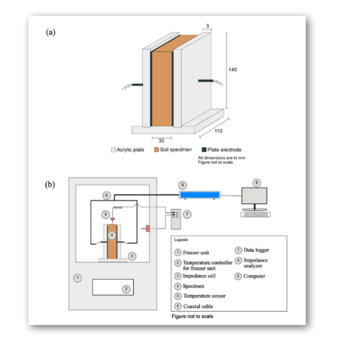

# A methodology to establish freezing characteristics of partially saturated sands

Authors: K.P. Lijith, Vikas Sharma, D.N. Singh

## Abstract

The thermo-hydro-mechanical (THM) properties of frozen soils depend primarily on the parameters like volumetric ice content, unfrozen water content, dry density, mineralogy, temperature etc. However, establishing the influence of ice/unfrozen water content on the abovementioned properties of frozen soils becomes a challenging task owing to the dependency of ice/unfrozen water content on temperature. The relationship between unfrozen water content and temperature is conventionally referred to as the ‘Soil Freezing Characteristics Curve’, SFCC. With this in view, an easy and efficient capacitance-based technique has been utilized to determine the volumetric ice content of standard sands of varying initial volumetric moisture content (=6%, 12%, 18%, 25 % and 41%) by exposing them from room temperature to −15°C in a controlled manner. It was found that the SFCCs obtained from these experiments depend upon the initial volumetric moisture content of the soils. Further, existing analytical SFCC models were employed to fit the experimental results. It was found that the model parameters are highly dependent upon the initial volumetric moisture content, and models are incapable of including the effect of initial water content on the SFCC.

Figure: Setup for measuring the electric properties of frozen/unfrozen soils


