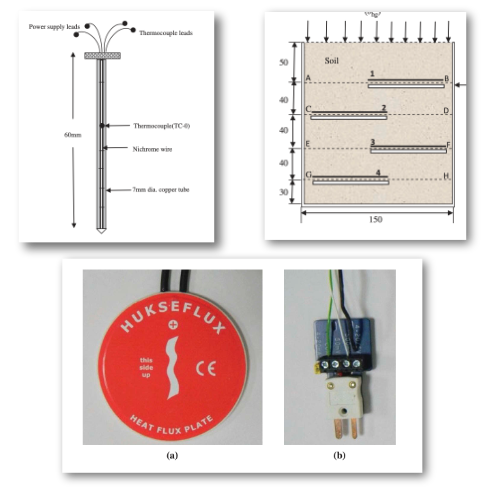

# A methodology to determine thermal conductivity of soils from flux measurement

Authors: Somenath Mondal, Vikas Sharma, D. N. Singh, Maryam Shojaei Baghini

## Abstract

Determination of thermal properties of soils (viz., thermal resistivity, thermal conductivity, thermal diffusivity and heat capacity), which primarily influence heat migration through the soil mass, is essential in situations where geomaterials are relentlessly subjected to higher temperatures and temperature variations. These properties of the soil mainly depend upon its type, mineralogy, particle size and gradational characteristics, density and water content. In this context, earlier researchers have determined thermal conductivity of soils by employing a thermal probe (a line heat source), which works on the principle of transient method (TM) of heat conduction. However, this methodology cannot be employed for establishing the heat flow (read thermal regime) through the soil. Hence, development of an alternate technique, which facilitates quantification of temporal and spatial variation of the heat flux and temperature in the soil mass, becomes essential. With this in mind, a methodology to determine thermal conductivity of soils by employing the concept of thermal flux measurement (TFM) has been developed and its details are presented in this paper. Results obtained from the TM and TFM have also been critically evaluated for the sake of validation and generating more confidence in the proposed methodology.


