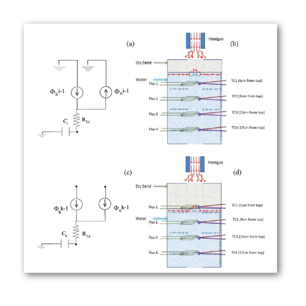

# Electrical analogy for modelling thermal regime and moisture distribution in sandy soils

Authors: Somenath Mondal, Vikas Sharma, P. Apte, D. N. Singh

## Abstract

The soil mass is subjected to temperature variation due to several human activities (viz. tanks storing heated fluids, buried cables and pipelines, air-conditioning ducts, disposal of nuclear and thermal power plant wastes etc.), which result in heat-induced migration of the moisture in it. Though several studies have been conducted in the past to investigate the mechanism of heat migration through the soil mass, a methodology for ‘real-time measurement of the variations in temperature, flux and moving moisture front, in tandem, with respect to space' has rarely been attempted. In this context, extensive laboratory investigations were conducted to measure real-time flux and temperature variations in the sandy soils, and the validation of results has been done by employing an equivalent electrical circuit programme, LTspice. Subsequently, a mathematical model PHITMDS (i.e. Prediction of Heat-Induced Temperature and Moisture Distribution in Soil) has been developed and its utility and efficacy, for predicting the depth-wise temperature and heat-induced moisture migration, due to evaporation, in terms of position of moving moisture front in the sandy soil has been critically discussed and demonstrated.


