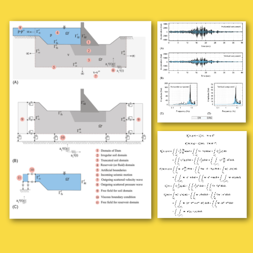

# Space‐time finite element procedure with block‐iterative algorithm for dam‐reservoir‐soil interaction during earthquake loading

Authors: Vikas Sharma, Kazunori Fujisawa, Akira Murakami

## Abstract

This paper presents a time-discontinuous Galerkin space-time finite element method for the seismic analysis of dam-reservoir-soil system. For the reservoir domain an auxiliary variable q, a first-order time derivative of hydrodynamic pressure is introduced as the primary unknown. Similarly, velocity is taken as the primary unknown in the solid domain. In this approach, secondary unknowns (displacement and pressure) are computed in a postprocessing step by consistent time integration of the primary unknowns. This arrangement leads to a system of linearly coupled algebraic equations, which is solved with a block-iterative algorithm. In each iteration of the algorithm, two smaller linear systems, ie, one for velocity field and another for the auxiliary field, are solved separately and coupling between these two fields is enforced through iterations. Afterwards, numerical performance of the proposed scheme is demonstrated by solving some benchmark dam-reservoir interaction problems. It is shown that very few iterations are required for the convergence. Lastly, the method is employed to analyze the effects of dynamic interactions on the response of concrete dam to the earthquake loading.


