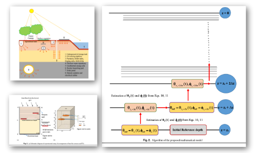

# Determination of Thermal Regime in Sandy Soils: Mathematical Framework ATHERES

Authors: Somenath Mondal, Vikas Sharma, D. N. Singh, Maryam Shojaei Baghini

## Abstract

Estimation of the thermal regime in soil mass is a key issue in the realms of agronomy, forestry, ecology, micrometeorology, and geotechnical engineering. Usually, it is predicted by solving heat-conduction equa- tions (HCEs) numerically and/or analytically by imposing assumptions such as (1) the sinusoidal variation in temperature (caused by the change in the ambience as a result of the solar cycle) at the top soil surface and/or (2) the uniform initial temperature of the soil mass. However, these solutions sometimes yield an improper thermal regime because of simplified assumptions that are not always suitable for natu- ral soil surfaces. In this paper, the novel algorithm ATHERES (algorithm for thermal regime estimation in soils), which can be used for predicting thermal regime in sandy soil mass, is presented. The proposed approach eliminates the necessity for solving the HCE, and thus, the obtained thermal regime in sandy soil mass is free from the assumptions associated with conventional approaches. Performance of the proposed approach was demonstrated by using the results obtained from a series of laboratory tests on sandy soils of different particle sizes. The study reveals that the ATHERES is capable of incorporating naturally occurring temperatures and flux boundary conditions, including the ini- tial condition of a nonzero thermal gradient.


