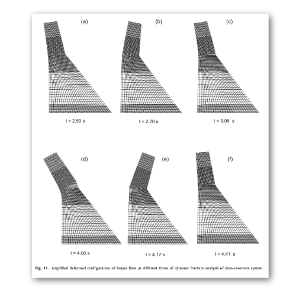

# Space–time FEM with block-iterative algorithm for nonlinear dynamic fracture analysis of concrete gravity dam

Authors: Vikas Sharma, Kazunori Fujisawa, Akira Murakami

## Abstract

In this paper, space–time finite element method is developed for the dynamic fracture analysis of dam–reservoir (DR) system which is supported on a perfectly rigid foundation. In this method, an auxiliary variable representing the first-order time derivative of hydrodynamic pressure is treated as the primary unknown for the reservoir domain. Similarly, velocity is the primary unknown for the solid domain. A three point Gauss–Lobatto quadrature rule is employed for computing time integral of those terms which contain stress term. Further, a partitioned method based on a block-iterative scheme is employed to incorporate the material nonlinearity of the concrete and to enforce the coupling between the two domains in a single iteration loop. A co-axially rotating crack model with exponential strain softening rule is employed to model the fracture of the concrete. Afterwards, numerical performance of the proposed scheme is demonstrated by analyzing two situations of dynamic fracture of Koyna concrete gravity dam.

Figure: Seismic fracture response of concrete gravity dam


