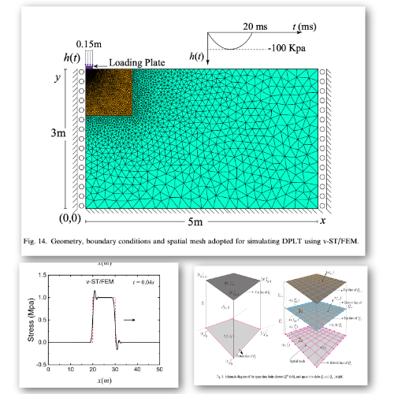

# Velocity-based time-discontinuous Galerkin space-time finite element method for elastodynamics

Authors: Vikas Sharma, Kazunori Fujisawa, Akira Murakami

## Abstract

A velocity-based single-field Space-Time Finite Element Method (v-ST/FEM) is devised within the framework of the time-discontinuous Galerkin method for an elastodynamics problem. The new method uses finite elements for both space and time domains, and reduces the size of the resulting linear system to be solved in each time step compared to the two-field formulation. In v-ST/FEM, the trial functions for the velocity field are continuous in space and discontinuous in time, while the test functions are continuous in both space and time. The displacement and stress fields are computed in a post-processing step using the time-integration process which explicitly includes the velocity field. Accordingly, the displacement-velocity compatibility condition and the continuity of the displacement field in time are strongly imposed in the displacement-velocity-based two-field formulation. In this way, a velocity-based single-field weak formulation is derived from the two-field formulation. The present method is found to be unconditionally stable and third-order accurate. Following a review of the space–time finite element literature, the general theoretical development and formulation aspects of the present methodology are demonstrated. Several numerical examples are given to show the computational performance of the proposed scheme.


